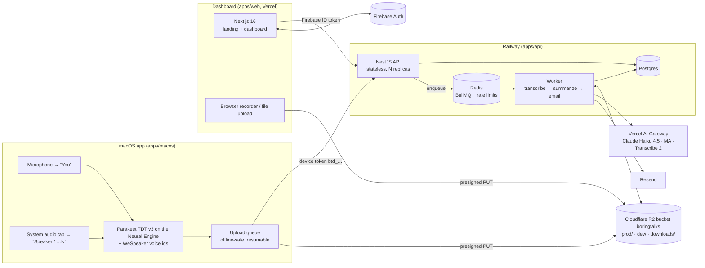
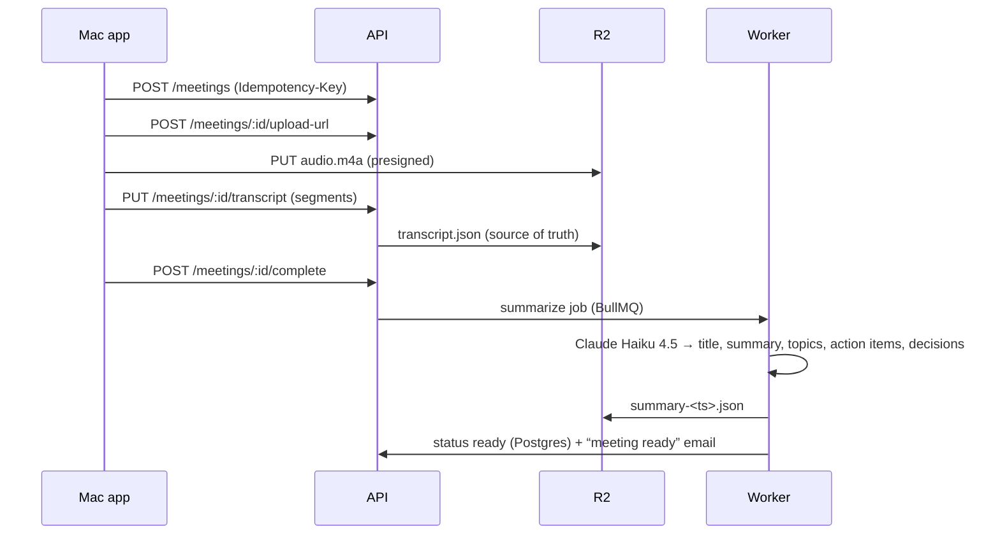

# Architecture

BoringTalks is a simplified Fireflies: record a meeting, get a transcript, a summary, key topics,
action items, decisions and a title that says what the meeting was about.



## The main decision: where speech becomes text

Transcription is the only expensive step of a meeting recorder; summarizing a transcript is cheap.
So the Mac does the transcription, for free, and the backend does the describing:

| Step | Where | Why |
|---|---|---|
| Capture | Mac: Core Audio process tap + microphone | Both sides of any call app, no bot joining the meeting |
| Transcription | Mac: Parakeet TDT 0.6B v3 on the Neural Engine | 1 h of audio in ~2 min on an M1, 25 languages, $0 per minute |
| Who said what | Mac: mic = “You”; system voices told apart with WeSpeaker embeddings | Speaker labels come for free with two separate channels |
| Title, summary, action items | Server worker: Claude Haiku 4.5 via AI Gateway | ~$0.02 per meeting-hour, one structured call |
| Fallback transcription | Server worker: MAI-Transcribe 2 (with speakers) via AI Gateway | Browser recordings / uploads, $0.10 per hour; Macs set to transcribe online, each channel on its own |

The Mac uploads a transcript of a few kilobytes plus, optionally, 32 kbps AAC audio (~14 MB/h)
straight to R2 for playback. Numbers in [COSTS.md](COSTS.md).

## Request flows

**Mac recording**



**Browser recording / upload:** same, but without a transcript `complete` sends the meeting to the
`transcribe` queue first (MAI-Transcribe 2: a phrase per speaker turn), then to `summarize`.

**Mac recording, transcribed online** (a Settings choice): the Mac records the microphone and system
audio on separate channels of one stereo file and asks for the upload URL with
`channels: "mic-system"`; there is no transcript step. The worker splits the channels with ffmpeg,
transcribes both in parallel (the microphone becomes "You", the system side keeps its speakers),
drops the microphone's echo with the Mac's rule, and stores a mono mix for playback.

**Mac sign-in (PKCE):** the app opens `boringtalks.lol/connect?challenge=…&device=…`; the signed-in
dashboard calls `POST /devices/authorize` and redirects to `boringtalks://callback?code=…`; the app
exchanges code + verifier at `POST /devices/token` for a long-lived, revocable `btd_…` token kept in
the Keychain. The Mac app never sees a Firebase credential and needs no Firebase SDK.

**Problem reports:** the Mac app's "Report a Problem…" (or a hang it noticed) posts its version, macOS,
diagnostics and its own recent log to `POST /reports`; the row lands in `problem_reports`, an optional
email goes to `REPORTS_NOTIFY_EMAIL` through the `email` queue, and `node dist/reports.js` reads them.

## Built for a crowded site

- **Stateless API, scaled by replicas.** No sessions, no local files. Auth is a JWT check against
  Google's cached JWKS (no Firebase Admin call) or one indexed hash lookup for device tokens.
- **Heavy work never runs in a request.** The API only enqueues; workers scale separately and their
  concurrency is capped (`SUMMARIZE_CONCURRENCY`) to stay inside AI Gateway rate limits, so a spike
  becomes a queue, not errors.
- **Bytes bypass the API.** Audio goes client → R2 and R2 → browser with presigned URLs; R2 has no
  egress fees.
- **Idempotent everything.** Deterministic job ids (`<meeting>_<stage>_<run>`) collapse duplicates;
  stale runs do nothing; emails are claimed in `email_log` and sent with an idempotency key;
  `POST /meetings` honours `Idempotency-Key` for client retries.
- **Bounded reads.** Keyset pagination on `(user_id, started_at desc, id desc)`, a cached
  `speakers` array for list rows, full-text search on GIN indexes.
- **Rate limits in Redis** per user (or IP), stricter on token exchange and upload URLs.
- **Graceful shutdown.** Workers finish the active job on SIGTERM (60 s drain); the API stops
  accepting requests first.
- **Static where possible.** The landing page is statically rendered on Vercel's CDN; only the
  signed-in dashboard talks to the API.

Next steps if traffic grew: Postgres read replica for list/search, Redis Cluster, per-region
workers, and streaming (chunked) uploads of the transcript during long meetings.

## Repository layout

```
apps/api        NestJS API + BullMQ worker (one image, two start commands)
apps/web        Next.js 16 landing page + dashboard
apps/macos      Swift/SwiftUI menu-bar recorder (XcodeGen)
packages/shared zod schemas = the API contract, plus transcript helpers
e2e/            Playwright: UI suite (Firebase Auth emulator) and smoke suite (deployed envs)
docs/           this documentation
.github/        CI, deploys, DMG pipeline
```

## Environments

| | Production | Dev |
|---|---|---|
| Web | https://boringtalks.lol | https://dev.boringtalks.lol |
| API | https://api.boringtalks.lol | https://api.dev.boringtalks.lol |
| DMG | BoringTalks: https://download.boringtalks.lol (`downloads/`) | BoringTalks Dev: https://download.boringtalks.lol/dev/ (`downloads/dev/`) |
| Storage prefix in R2 bucket `boringtalks` | `prod/` | `dev/` |
| Deployed by | push to `main` | a ready (non-draft) pull request |

Details in [DEPLOYMENT.md](DEPLOYMENT.md).
